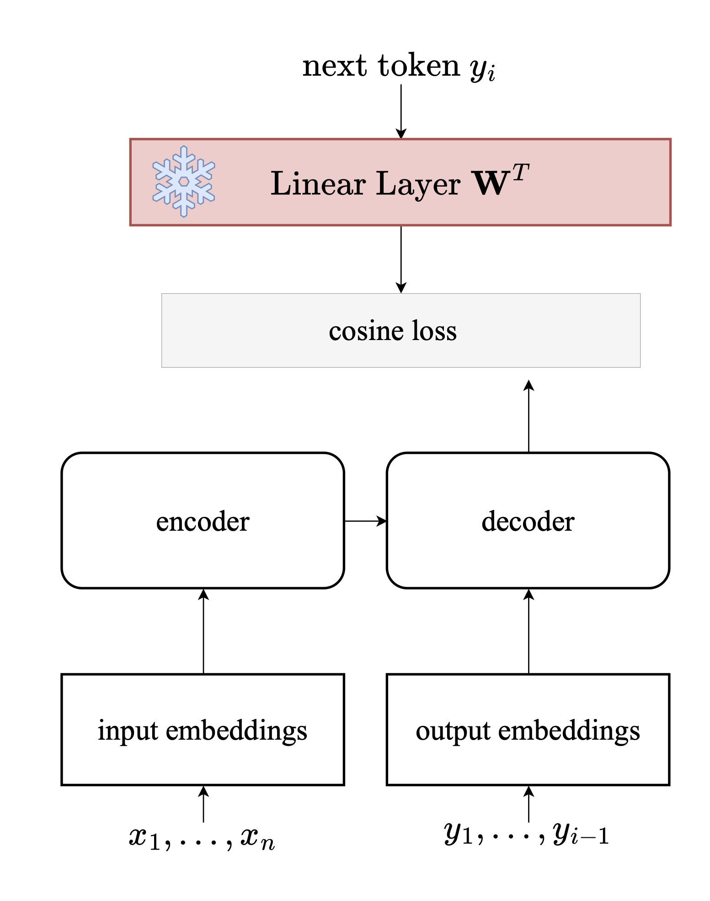

# Model Card for RoEn-CoNMT-random

## Model Details

### Model Description

- **Developed by:** Evgeniia Tokarchuk, Vlad Niculae
- **Funded by:** This work was partly supported by the Dutch Research Council (NWO) via VI.Veni.212.228 and the European Union’s Horizon Europe research and innovation programme via UTTER 101070631.
- **Shared by:** Evgeniia Tokarchuk
- **Model type:** Machine Translation
- **Language(s) (NLP):** ro, en
- **License:**: MIT

### Model Sources

- **Repository:** https://github.com/afeena/cdgm_textgen
- **Paper:** [The Unreasonable Effectiveness of Random Target Embeddings for Continuous-Output Neural Machine Translation](https://aclanthology.org/2024.naacl-short.56/) (Tokarchuk & Niculae, NAACL 2024)

## Uses


### Direct Use

Translation from Romanian to English in continuous space for news domain.

## Bias, Risks, and Limitations
While continuous-output models can provide greater output diversity, their overall performance on automatic quality metrics is lower than that of their discrete counterparts. Therefore, the use of continuous-output models is not recommended in applications where high-quality output is a primary requirement.
Target embeddings are not trainable to prevent model collapse.


## How to Get Started with the Model

Th code source [cdgm_textgen](https://github.com/afeena/cdgm_textgen) is based on [fairseq](https://github.com/facebookresearch/fairseq) framework (depricated as of March 2026).

1. Download and preprocess data as described in [preprocessing](#preprocessing)
<!-- 2. Extract target embeddings
   
   ``` 
   python extract_target_embeddings.py --model-path roen-contmt-mttransfer.pt --dictionary data/ro-en/dict.en.txt --output mttransfer_output_emb.txt
   ``` -->

2. Download library with `git`

    ```
    git clone https://github.com/afeena/cdgm_textgen
    cd cdgm_textgen
    ```

3. Translate test data with CLI:
    ```
    #run decoding with decode.py from cdgm_textgen lib
    python decode.py </path/to/data> --beam 1 --task translation --source-lang ro --target-lang en --print-step  --decoding-measure cosine  --path roen-conmt-random.pt --input </path/to/testfile> > hyp.txt

    #extract and postprocess hypothesis
    cat hyp.txt | grep -P "^H" | sort -V | cut -f3- | ~/develop/sentencepiece/build/src/spm_decode --model=mbart.cc25.v2/sentence.bpe.model  | sed 's/▁//g' | sacremoses -l en detokenize | sacremoses -l en detruecase > hyp_eval_ready.txt

    #score hypothesis
    cat hyp_eval_ready.txt | sacrebleu <data/ro-en/newsdev2016.en>

    bert-score -r <data/ro-en/newsdev2016.en> -c hyp_eval_ready.txt --lang en --rescale_with_baseline 
    ```

## Training Details

### Training Data

WMT 2016 Ro-En https://www.statmt.org/wmt16/

### Training Procedure

#### Preprocessing 

**Install libraries**: [mosesdecoder](https://github.com/moses-smt/mosesdecoder), [sentencepiece](https://github.com/google/sentencepiece)

**Download additional files**

1. Preprocessing scripts from [Linguistic Input Features Improve Neural Machine Translation](https://aclanthology.org/W16-2209/) (Sennrich & Haddow, WMT 2016):

    [normalise-romanian.py](https://github.com/rsennrich/wmt16-scripts/blob/master/preprocess/normalise-romanian.py)

    [remove-diacritics.py](https://github.com/rsennrich/wmt16-scripts/blob/master/preprocess/remove-diacritics.py)

2. Pre-trained UnigramLM model from [mBART 25](https://huggingface.co/docs/transformers/main/model_doc/mbart) 

    [sentencepiece.bpe.model](https://huggingface.co/facebook/mbart-large-cc25/blob/e84f32f3b320dcc2ee3d0c0d257c978137d10c25/sentencepiece.bpe.model) 

```
#!/bin/bash


SPM_ENCODE=sentencepiece/build/src/spm_encode
SRC="ro"
TRG="en"


for prefix in train newsdev2016 newstest2016
 do
   cat $prefix.$SRC | \
   sacremoses -l $SRC normalize |
   /home/etokarc/local/bin/python3.8 normalise-romanian.py | \
   /home/etokarc/local/bin/python3.8 remove-diacritics.py | \
   sacremoses -l $SRC tokenize > data-pp/$prefix.tok.$TRG

   cat $prefix.$TRG | \
   sacremoses -l $TRG normalize | \
   sacremoses -l $TRG tokenize > data-pp/$prefix.tok.$TRG

 done

for l in $SRC $TRG
  do
    cat data-pp/train.tok.$l | sacremoses train-truecase -m data-pp/truecase-model.$l
  done

for prefix in train newsdev2016 newstest2016
  do
    cat data-pp/$prefix.tok.$SRC | sacremoses truecase -m data-pp/truecase-model.$SRC > data-pp/$prefix.tok.tc.$SRC
    cat data-pp/$prefix.tok.$TRG | sacremoses truecase -m data-pp/truecase-model.$TGT > data-pp/$prefix.tok.tc.$TRG
  done

for prefix in train newsdev2016 newstest2016
  do
    SPM_ENCODE --model=sentencepiece.bpe.model --output_format=piece < data-pp/$prefix.tok.tc.$SRC > data-pp/$prefix.tok.tc.spm.$SRC
    SPM_ENCODE --model=sentencepiece.bpe.model --output_format=piece < data-pp/$prefix.tok.tc.$TGT > data-pp/$prefix.tok.tc.spm.$TGT
  done
```

#### Training Hyperparameters

```
task:
_name: translation
data: </path/to/data>
criterion:
_name: cosine_ar_criterion
model:
_name: continuous_transformer
decoder:
output_dim: 128
learned_pos: true
encoder:
learned_pos: true
dropout: 0.3 
target_embed_path: </path/to/random/target/embeddings>
no_decoder_final_norm: false
optimizer:
  _name: adam
  adam_betas: (0.9,0.98)
  lr_scheduler:
    _name: inverse_sqrt
    warmup_updates: 10000 
    warmup_init_lr: 1e-07
dataset:
  validate_after_updates: 10000
  max_tokens: 4096
  validate_interval_updates: 2000
optimization:
  lr: [0.0005]
  update_freq: [16]
  max_update: 50000
  stop_min_lr: 1e-09
checkpoint:
  no_epoch_checkpoints: true
  best_checkpoint_metric: bleu
  maximize_best_checkpoint_metric: true
```

#### Speeds, Sizes, Times 
```
Model size: 73,840,640 trained parameters
Total training time: 2d 58m 40s
System Hardware
CPU count	16
Logical CPU count	32
GPU count	1
GPU type	GeForce GTX TITAN X
```

## Evaluation

<!-- This section describes the evaluation protocols and provides the results. -->

### Testing Data, Factors & Metrics

#### Testing Data

WMT 2016 RoEn `newsdev2016` and `newstest2016`

#### Metrics

<!-- These are the evaluation metrics being used, ideally with a description of why. -->

**BLEU** : [sacrebleu]([mjpost/sacrebleu](https://github.com/mjpost/sacrebleu))

**BERT Score** : [bert_score](https://github.com/Tiiiger/bert_score)

### Results

|model|BLEU|BERTSc|
|-----|----|------|
random uniform |28.8 | 58.8
random cube|28.7 | 58.8


## Technical Specifications

### Model Architecture and Objective

#### Architecture overview



#### Cosine loss:

$$ \mathcal{L}_\text{CoNMT}(y_i=t; \bm{y}_{<i}, \bm{x}) =1-\operatorname{cos}(\bm{E}, \bm{H}).$$
where $t$ is a token index, $\mathcal{V}$ is the vocabulary, $\bm{E} = \bm{e}(t)$ and $\bm{e}:\mathcal{V} \to \mathbb{R}^{m}$
is an embedding lookup,
and $\bm{H}$ is a transformer hidden state calculated in terms of  $\bm{x}$ and the output prefix $\bm{y}_{<i}$.

#### Spherical uniform.
We draw embeddings uniformly from the surface of the sphere: $\bm{e}(y_i) \sim \operatorname{Unif}(\mathbb{S}_{m})$. Since standard normal vectors are distributed with rotational symmetry around the origin, uniform samples on the sphere can be obtained by normalizing standard normal random vectors: 

$$\bm{e}(y_i) = \bm{u}_i / \|\bm{u}_i\|; \quad \bm{u}_i \sim \operatorname{Normal}(\bm{0}, \bm{I}_d).$$ 

The same argument works if the normal distribution has spherical covariance $\sigma \bm{I}_d$ for any $\sigma$, and thus, since the cosine loss is norm-invariant, uniform initialization is exactly equivalent to the standard initialization of transformer embeddings.

#### Hypercube.
The corners of the hypercube $\{-1, 1\}^d$ all have norm $\sqrt{d}$ and thus form a discrete subset of a hypersphere. This motivates us to consider drawing embeddings from a scaled Rademacher distribution:
$$
\bm{e}(y_i) = \bm{r}_i /\sqrt{d};
\quad
\bm{r}_i \sim \operatorname{Rademacher}(d).
$$
Each coordinate of $\mathbf{r}_i$ has 50\% probability of being $+1$ and 50\% of being $-1$. With this strategy, any two distinct embeddings have cosine distance at least \(2/d\). Moreover, hypercubic embeddings can be stored as bit patterns and potentially allow for faster loss calculation with dedicated low-level implementations which we do not explore here.

## Citation

**BibTeX:**
```
@inproceedings{tokarchuk-niculae-2024-unreasonable,
    title = "The Unreasonable Effectiveness of Random Target Embeddings for Continuous-Output Neural Machine Translation",
    author = "Tokarchuk, Evgeniia  and
      Niculae, Vlad",
    editor = "Duh, Kevin  and
      Gomez, Helena  and
      Bethard, Steven",
    booktitle = "Proceedings of the 2024 Conference of the North American Chapter of the Association for Computational Linguistics: Human Language Technologies (Volume 2: Short Papers)",
    month = jun,
    year = "2024",
    address = "Mexico City, Mexico",
    publisher = "Association for Computational Linguistics",
    url = "https://aclanthology.org/2024.naacl-short.56/",
    doi = "10.18653/v1/2024.naacl-short.56",
    pages = "653--662",
    abstract = "Continuous-output neural machine translation (CoNMT) replaces the discrete next-word prediction problem with an embedding prediction.The semantic structure of the target embedding space (\textit{i.e.}, closeness of related words) is intuitively believed to be crucial. We challenge this assumption and show that completely random output embeddings can outperform laboriously pre-trained ones, especially on larger datasets. Further investigation shows this surprising effect is strongest for rare words, due to the geometry of their embeddings. We shed further light on this finding by designing a mixed strategy that combines random and pre-trained embeddings, and that performs best overall."
}
```

```
@inproceedings{tokarchuk-niculae-2022-target,
    title = "On Target Representation in Continuous-output Neural Machine Translation",
    author = "Tokarchuk, Evgeniia  and
      Niculae, Vlad",
    editor = "Gella, Spandana  and
      He, He  and
      Majumder, Bodhisattwa Prasad  and
      Can, Burcu  and
      Giunchiglia, Eleonora  and
      Cahyawijaya, Samuel  and
      Min, Sewon  and
      Mozes, Maximilian  and
      Li, Xiang Lorraine  and
      Augenstein, Isabelle  and
      Rogers, Anna  and
      Cho, Kyunghyun  and
      Grefenstette, Edward  and
      Rimell, Laura  and
      Dyer, Chris",
    booktitle = "Proceedings of the 7th Workshop on Representation Learning for NLP",
    month = may,
    year = "2022",
    address = "Dublin, Ireland",
    publisher = "Association for Computational Linguistics",
    url = "https://aclanthology.org/2022.repl4nlp-1.24/",
    doi = "10.18653/v1/2022.repl4nlp-1.24",
    pages = "227--235",
    abstract = "Continuous generative models proved their usefulness in high-dimensional data, such as image and audio generation. However, continuous models for text generation have received limited attention from the community. In this work, we study continuous text generation using Transformers for neural machine translation (NMT). We argue that the choice of embeddings is crucial for such models, so we aim to focus on one particular aspect'':'' target representation via embeddings. We explore pretrained embeddings and also introduce knowledge transfer from the discrete Transformer model using embeddings in Euclidean and non-Euclidean spaces. Our results on the WMT Romanian-English and English-Turkish benchmarks show such transfer leads to the best-performing continuous model."
}

## Model Card Authors

Evgeniia Tokarchuk

## Model Card Contact

Evgeniia Tokarchuk (evgeniia@tokarch.uk)
